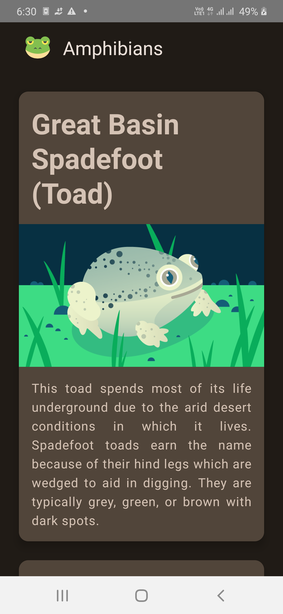
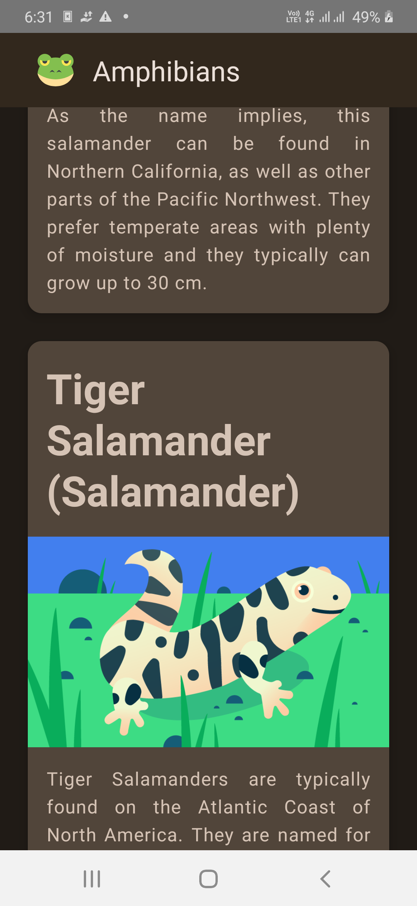

 
 <h1 align="center">Amphibians</h1>

 Kotlin Jetpack Compose App to see about the different Amphibians.

# Screenshots

  

# Credits
The Frog Icon from [svgrepo](https://www.svgrepo.com/svg/401839/frog-face)
